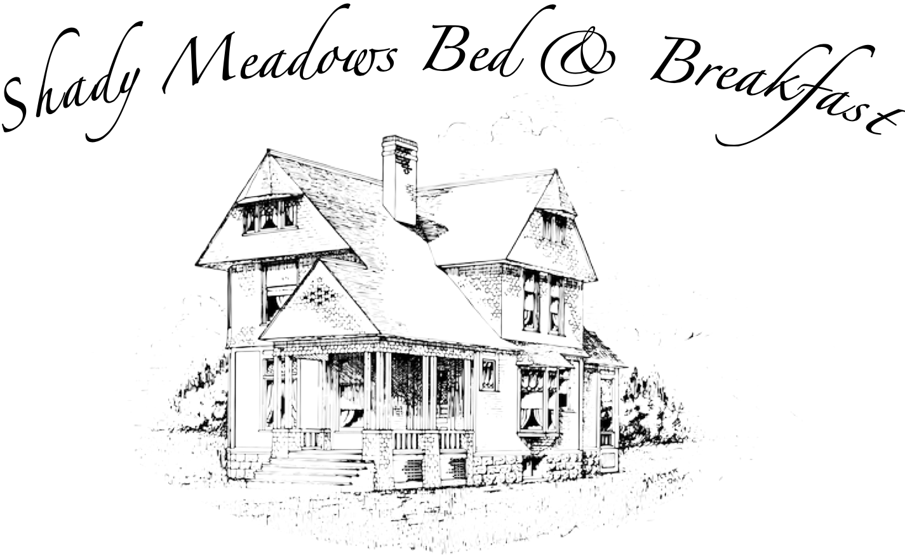
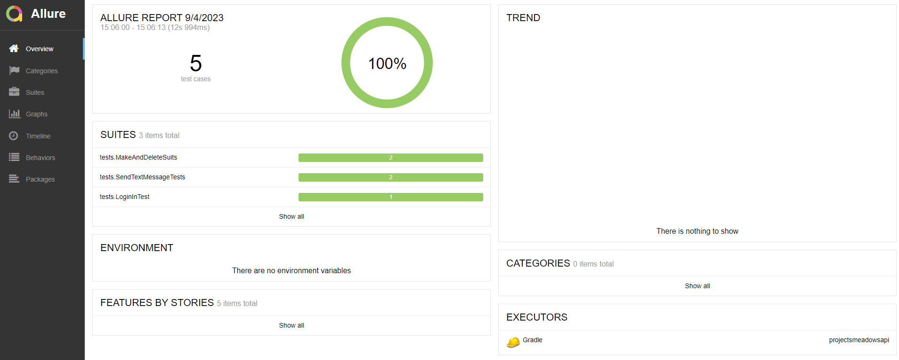
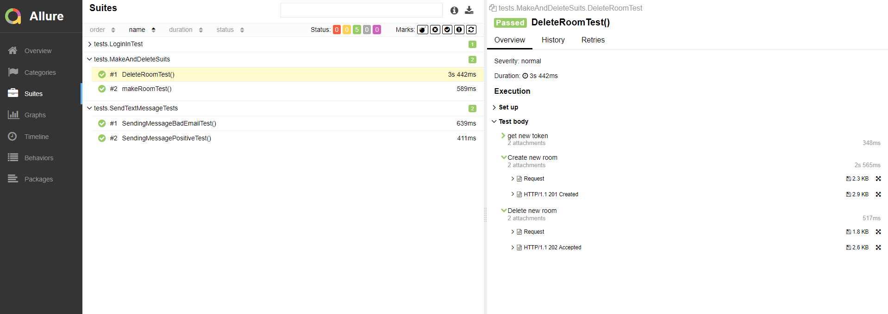
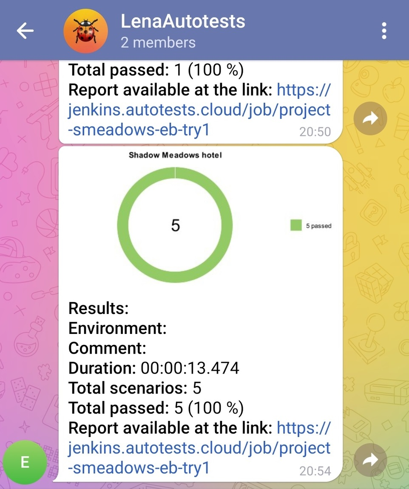

# Проект по тестированию API сайта "Shady Meadows"  
сделано в рамках дипломного проекта для qa.guru
 

> <a target="_blank" href="https://automationintesting.online/">automationintesting.online</a>
 

## Оглавление

- <a href="#tools">Использованный стек технологий</a>
- <a href="#list">Список проверок</a> 
- <a href="#allure">Результаты запуска тестов в Allure</a> 
- <a href="#telegram">Результаты запуска тестов в Telegram</a>

 
 

Для написания проектов использовался язык **Java**. Среда сборки **IntelliJ IDEA** сочетается с **Gradle**.
**JUnit5** - фреймворк модульного тестирования.   

**Allure Report** использован  для визуализации результатов проверок.

## :heavy_check_mark: Тест кейсы
- Проверка на успешную авторизацию
- Проверка на отправку сообщения 
- Проверка на неуспешную отправку сообщения при несоблюдении формата email
- Проверка на создание нового номера отеля
- Проверка на удаление созданного номера отеля

## </a> Отчет в <a target="_blank" href="https://allure.autotests.cloud">Allure Report</a>

 
 

> Отчет позволяет детально посмотреть шаги выполнения тестов

## </a> Уведомление в Telegram при помощи бота

 
 

> Отчетность о результатах проверок в мессенджере Telegram

 
 